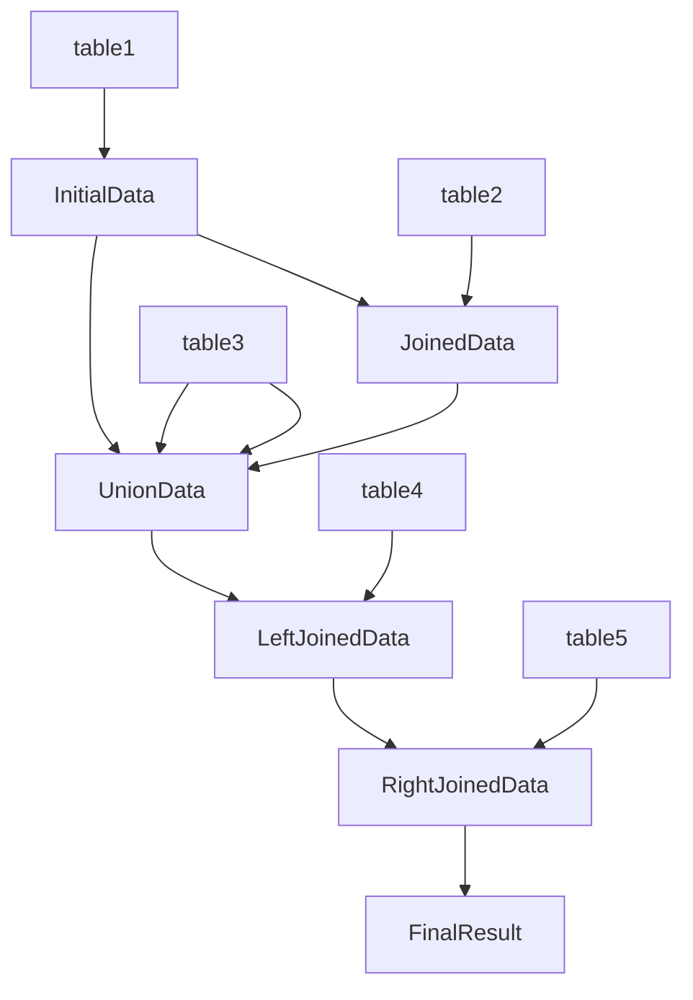

```mermaid
graph TD;

InitialData["InitialData"]
JoinedData["JoinedData"]
UnionData["UnionData"]
LeftJoinedData["LeftJoinedData"]
RightJoinedData["RightJoinedData"]
FinalResult["FinalResult"]

table1 --> InitialData
InitialData --> JoinedData
table2 --> JoinedData
JoinedData --> UnionData
table3 --> UnionData
InitialData --> UnionData
table3 --> UnionData
UnionData --> LeftJoinedData
table4 --> LeftJoinedData
LeftJoinedData --> RightJoinedData
table5 --> RightJoinedData
RightJoinedData --> FinalResult
```